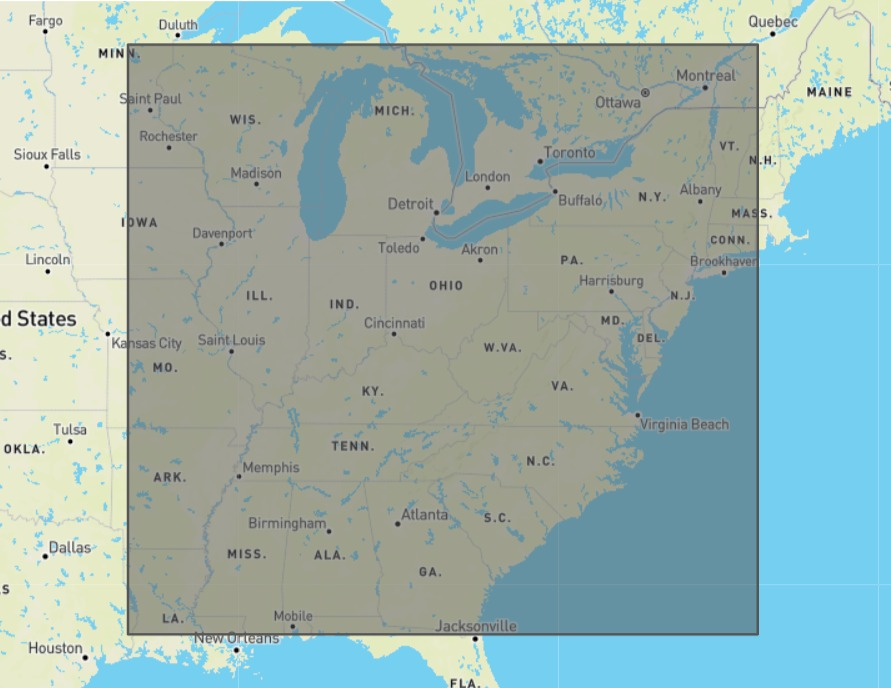
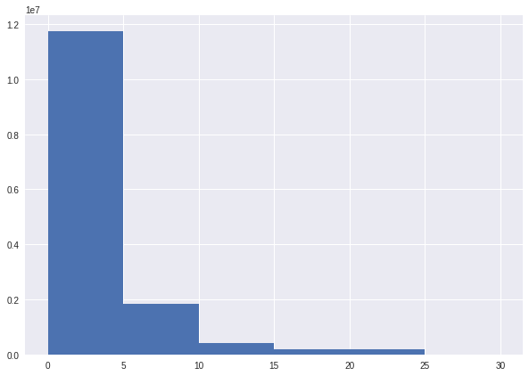
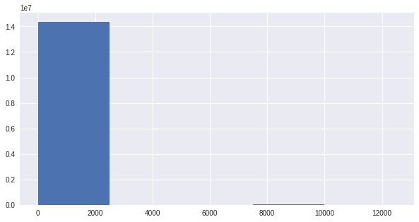

# **davekh-taxi**
 

## 1.	**What datetime range does your data cover?  How many rows are there total?**
 

**Datetime Range**
    <blockquote>Maximum:- 2013-07-01 01:14:24 
      Minimum:- 2013-03-22 08:04:00</blockquote>
 

**Total Rows** <blockquote>There are total 14 rows. </blockquote>
<blockquote>

| medallion      | hack_license | vendor_id | rate_code | store_and_fwd_flag|pickup_datetime| dropoff_datetime | passenger_count | trip_time_in_secs | trip_distance | pickup_longitude | pickup_latitude | dropoff_longitude | dropoff_latitude |
| :---------- | ----------- | ----------- | ----------- |----------- |----------- |----------- |----------- |----------- |----------- |----------- |----------- |----------- |----------: |

</blockquote>

#

## 2.	**What are the field names?  Give descriptions for each field.**
 

**Field Names**  
<blockquote>

| medallion      | hack_license | vendor_id | rate_code | store_and_fwd_flag|pickup_datetime| dropoff_datetime | passenger_count | trip_time_in_secs | trip_distance | pickup_longitude | pickup_latitude | dropoff_longitude | dropoff_latitude |
| :---------- | ----------- | ----------- | ----------- |----------- |----------- |----------- |----------- |----------- |----------- |----------- |----------- |----------- |----------: |

</blockquote>

**Description of each field**  
<blockquote>

**medallion** :- Also known as a CPNC, is a transferable permit in the United States allowing a taxicab driver to operate.  
**hack_license** :- Taxi license number.  
**vendor_id** :-  The unique sequence which is assigned to each vendor in order to establish a recordkeeping and tracking system.  
**rate_code** :- Rate codes are taxi's meter setting.  
**store_and_fwd_flag** :- This flag indicates whether the trip record was held in vehicle's memory before sending to the vendor, aka “store and forward,” because the vehicle did not have a connection to the server.  
**picup_datetime & dropoff_datetime** :- Date and time for a particular trip's pickup and dropoff respectively.  
**passenger_count** :- Number of customer for that trip.  
**trip_time_in_secs** :- Recorded total trip time in seconds.  
**trip_distance** :- Recorded total trip distance.  
**pickup_longitude & pickup_latitude** :- The exact location from where the passenger were picked.  
**dropoff_longitude & dropoff_latitude** :- The exact location to where the passenger were dropped. 

</blockquote>

#

## 3.	**Give some sample data for each field.**
 

<blockquote>

|medallion| hack_license| vendor_id| rate_code| store_and_fwd_flag| pickup_datetime| dropoff_datetime| passenger_count| trip_time_in_secs| trip_distance| pickup_longitude| pickup_latitude| dropoff_longitude| dropoff_latitude|
---------------------------|---------------------------|---------------------------|---------------------------|---------------------------|---------------------------|---------------------------|---------------------------|---------------------------|---------------------------|---------------------------|---------------------------|---------------------------|---------------------------|
D1C79CF706C80D3A1DC7FBCA6CD56E43|DAC7742E8F00034774098DBC6B4FF2B7|CMT|1|N|2013-06-03 00:02:12|2013-06-03 00:10:07|1|474|1.30|-73.981583|40.773529|-73.981827|40.782124
3567E8B49FEBFCBB587F1864D723D5C8|430B8022563CDE1D51D44786DFD8D6CB|CMT|1|N|2013-06-03 00:03:03|2013-06-03 00:19:27|1|982|4.90|-73.999565|40.728367|-73.952927|40.729546
4220E1995D36A40DF34664AD33ED13F6|48A1C9C9300AFC7BDBB718CE308EE45A|CMT|2|N|2013-06-03 00:01:30|2013-06-03 00:28:11|1|1745|17.70|-73.788445|40.641151|-73.985451|40.744194
440900089FF528A873424DED689C77A3|E6A63B40E565A8A03AF32E0B138F5EB1|CMT|1|N|2013-06-03 00:04:14|2013-06-03 00:27:50|1|1415|12.10|-73.862816|40.768875|-74.008797|40.738842

</blockquote>

#

## 4.	**What MySQL data types / len would you need to store each of the fields?**

    **int(xx), varchar(xx),date,datetime,bool, decimal(m,d)**
 

<blockquote>

| Column Name | Data Type |
| ----------- | -------------- |
| medallion |varchar(40) |
| hack_license |varchar(40) |
| vendor_id | varchar(5) |
| rate_code | varchar(5) |
| store_and_fwd_flag | varchar(1) |
| pickup_datetime | datetime(20) |
| dropoff_datetime| datetime(20) |
| passenger_count | integer(8) |
| trip_time_in_secs | integer(5) |
| trip_distance | float(8) |
| pickup_longitude | varchar(20) |
| pickup_latitude | varchar(20) |
| dropoff_longitude | varchar(20) |
| dropoff_latitude | varchar(20) |

</blockquote>

#

## 5.	**What is the geographic range of your data (min/max - X/Y)?. Plot this (approximately on a map)**
 

**Geographic Range**

<blockquote>

Maximun Longitude:- 2084.3237   
Minimum Longitude:- -2425.6233   
Maximum Latitude:- 3510.3816  
Minimum Latitude:- -3481.1292 

</blockquote>

<blockquote>

</blockquote>

#

## 6.	**What is the average computed trip distance? (You should use Haversine Distance).**

    **Draw a histogram of the trip distances binned anyway you see fit.**
  

**Average Trip Distance**

<blockquote>

19.098444218494517

</blockquote>

<blockquote>

</blockquote>

#

## 7.	**What are the distinct values for each field? (If applicable)**
 

<blockquote>

| Column Name | Distinct Value |
| ----------- | -------------- |
| medallion |13560 |
| hack_license |33487 |
| vendor_id | 3 |
| rate_code | 12 |
| store_and_fwd_flag | 4 |
| passenger_count | 10 |
| trip_time_in_secs | 6610 |
| trip_distance | 4231 |
| pickup_longitude | 44958 |
| pickup_latitude | 68774 |
| dropoff_longitude | 62729 |
| dropoff_latitude | 94800 |

</blockquote>

#

## 8.	**For other numeric types besides lat and lon, what are the min and max values?**
 

<blockquote> Maximum Rate Code = 210    Minimum Rate Code = 1 </blockquote>  

<blockquote> Maximum Passenger Count = 208 
Minimum Passenger Count = 1 </blockquote>  

<blockquote> Maximum Trip Time in Seconds = 10800 
Minimum Trip Time in Seconds = 240 </blockquote>  

<blockquote> Maximum Trip Distance = 1.52 
Minimum Trip Distance = 0.04 </blockquote>  

#

## 9.	**Create a chart which shows the average number of passengers each hour of the day. (X axis should have 24 hours)**
 

<blockquote>

</blockquote>

#

## 10.	**Create a new CSV file which has only one out of every thousand rows.**
 

<blockquote>

**The link to the CSV file**

[CSV File](CSV/TenthQ.csv)

</blockquote>

#

## 11.	**Repeat step 9 with the reduced dataset and compare the two charts.**
 

<blockquote>

</blockquote>

#